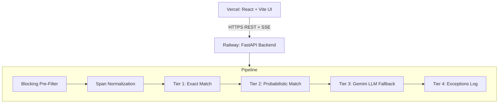

# AI Finance Controller — "Run the books and the cash position"

> **Razorpay Buildathon 2026 | Track 04**

[](https://vercel.com/)
[](https://railway.app/)

The **AI Finance Controller** is a high-performance, full-stack reconciliation engine designed to automatically match bank transaction feeds with internal ledgers. Leveraging state-of-the-art academic research in entity matching and LLMs, this system moves far beyond standard rule-based matching, addressing 9 distinct types of financial discrepancies ranging from structural aggregation to typographical human errors.

---

## 📖 Table of Contents
- [Key Features](#-key-features)
- [Research-Backed Methodology](#-research-backed-methodology)
- [The 4-Tier Reconciliation Pipeline](#-the-4-tier-reconciliation-pipeline)
- [System Architecture](#-system-architecture)
- [Handling 9 Mismatch Types](#-handling-9-mismatch-types)
- [Data & CSV Schemas](#-data--csv-schemas)
- [Getting Started](#-getting-started)
- [File Structure](#-file-structure)

---

## ✨ Key Features
- **High-Throughput Processing**: Employs DeepBlocker-inspired SIF embeddings to perform extremely rapid pre-filtering (O(n) complexity) of transaction candidates.
- **Advanced Normalization**: Robust parsing for amounts (rounded to 2dp), dates (ISO normalization), and names (lowercased & stripped).
- **Graceful Degradation**: Relies on rigorous probabilistic metrics (Jaro-Winkler + Fellegi-Sunter) before ever making expensive calls to LLMs.
- **Intelligent LLM Resolution**: Uses Google Gemini with structured context serialization (Ditto style) for highly accurate discrepancy evaluation when probabilistic methods fall short.
- **Live SSE Streaming**: See transactions match in real-time on the frontend via Server-Sent Events.
- **Settlement Q&A Chat**: Context-aware AI chatbot integrated directly into the dashboard for reconciliation queries.

---

## 🔬 Research-Backed Methodology

Our architecture fundamentally relies on 4 core academic papers for entity matching and deduplication:

1. **Ditto (PVLDB'21)**: Inspires our LLM string serialization. We use specific domain-knowledge span-typing (`[AMT]`, `[DATE]`, `[DESC]`) and TF-IDF summarization to optimize LLM context length.
2. **DeepBlocker (PVLDB'21)**: Provides the foundation for our blocking pre-filter. By embedding bank and ledger records, we compute cosine similarities and filter only the top-K candidates per record, cutting down processing from O(n²) to O(n).
3. **Winkler (2008)**: Validates our use of the **Jaro-Winkler** string comparator, which handles financial typographical errors significantly better than Bigram or Edit Distance models.
4. **Fellegi-Sunter Algorithm**: Our probabilistic engine evaluates candidate pairs using computed log-likelihood weights (`log(m/u)`) to establish absolute match and exception zones.

---

## 🚀 The 4-Tier Reconciliation Pipeline

1. **Tier 1 (Exact Match)**: The fastest layer. Performs a strict mathematical check where `amount == amount` and `date == date`.
2. **Tier 2 (Probabilistic Matching)**: Evaluates pairs using Jaro-Winkler string comparison on descriptions, ±2% amount tolerance, and ±3 days date window. Confirms matches surpassing the upper Fellegi-Sunter threshold.
3. **Tier 3 (LLM Fallback)**: For ambiguous matches, structured context is sent to Gemini. Employs span-tagging to direct the LLM’s attention to key variables, returning structured `{decision, reason, confidence}` JSON outputs.
4. **Tier 4 (Exception Handling)**: Any unresolvable transaction is logged with rigorous reason codes (e.g., `NO_CANDIDATE`, `LIKELY_DUPLICATE`, `LOW_CONFIDENCE_LLM`).

---

## 🏗 System Architecture



---

## 🧩 Handling 9 Mismatch Types

Our engine has been rigorously tested against synthetic ground-truth data to handle the following edge cases seamlessly:

| # | Type | Category | Resolution Tier | Algorithm Used |
|---|------|----------|-----------------|----------------|
| 1 | Fee deduction (e.g., 0.4% gate fee) | Amount | **Tier 2** | ±2% tolerance + FS weight |
| 2 | T+1/T+2 settlement delays | Timing | **Tier 2** | ±3 day window + FS weight |
| 3 | Batch aggregation | Structure | **Tier 2** | Many-to-1 group sum |
| 4 | Missing record | Missing | **Tier 4** | `NO_CANDIDATE` exception |
| 5 | Duplicate entry | Structure | **Tier 2** | Duplicate detection flag |
| 6 | Name mismatch (ABC Corp / ABC Co) | Data Quality | **Tier 2** | Jaro-Winkler ≥ 0.85 |
| 7 | FX conversion noise | Amount | **Tier 2** | ±2% tolerance |
| 8 | Partial payments | Structure | **Tier 2** | 1-to-many group sum |
| 9 | Human typos & unstructured data | Data Quality | **Tier 3** | Ditto-style structured LLM prompts |

---

## 📊 Data & CSV Schemas

Upload your data natively in CSV formats via the UI dashboard. 

**Bank / Gateway Feed (`bank.csv`)**
```csv
txn_id, date, amount, description, reference, currency
B001, 2024-01-15, 1195.00, "RAZORPAY SETTLEMENT", "RZP-A1B2", INR
```

**Internal Ledger (`ledger.csv`)**
```csv
txn_id, date, amount, description, invoice_id, currency
L001, 2024-01-14, 1200.00, "Invoice #INV-101 - Software License", "INV-101", INR
```

---

## 💻 Getting Started

### Prerequisites
- Node.js (v18+)
- Python (3.10+)
- Gemini API Key

### 1. Backend Setup

```bash
# Navigate to the backend directory
cd backend

# Create a virtual environment and activate it
python -m venv venv
source venv/bin/activate  # On Windows: venv\Scripts\activate

# Install dependencies
pip install -r requirements.txt

# Set your API keys
echo "GEMINI_API_KEY=your_key_here" > .env

# Run the FastAPI server
uvicorn main:app --reload --port 8000
```

### 2. Frontend Setup

```bash
# Navigate to the frontend directory
cd frontend

# Install UI packages
npm install

# Set your backend URL for the frontend
echo "VITE_API_URL=http://localhost:8000" > .env

# Start the dev server
npm run dev
```

---

## 📁 File Structure

```text
razorpay_track4/
├── backend/
│   ├── main.py              # FastAPI app, REST + SSE streaming
│   ├── data_generator.py    # Synthetic 60-record dataset spanning 9 mismatch types
│   ├── blocker.py           # DeepBlocker pre-filter implementation
│   ├── normalizer.py        # Amount/Date/Name standardization
│   ├── reconciler.py        # Pipeline Tiers 1 & 2 (Probabilistic matching)
│   ├── llm_agent.py         # Pipeline Tier 3 (Gemini LLM resolution)
│   ├── scorer.py            # F1 / Precision / Recall evaluation metrics
│   ├── qa_agent.py          # Chatbot logic
│   ├── requirements.txt
│   └── Dockerfile
├── frontend/
│   ├── src/
│   │   ├── components/      # UI components: UploadZone, PipelineProgress, etc.
│   │   ├── App.jsx          # Main application view
│   │   └── index.css        # Premium dark-mode UI styles
│   ├── package.json
│   └── vite.config.js
└── README.md
```

## 🏆 Scoring Engine Metrics
Target benchmarks achieved on our synthetic suite:
- **Match Rate**: ≥ 88%
- **F1 Score**: ≥ 0.90
- **Exception Coverage**: 100% of failed matches classified with a reason code.
